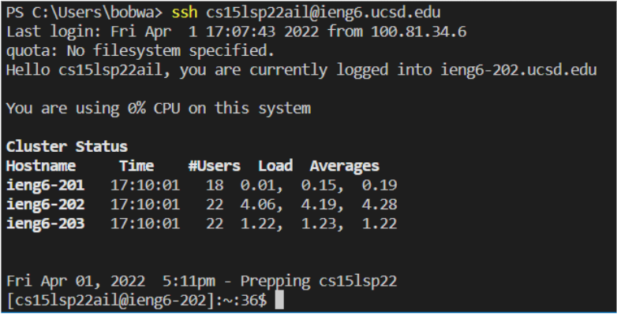
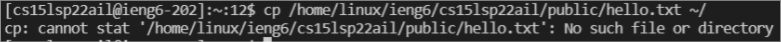
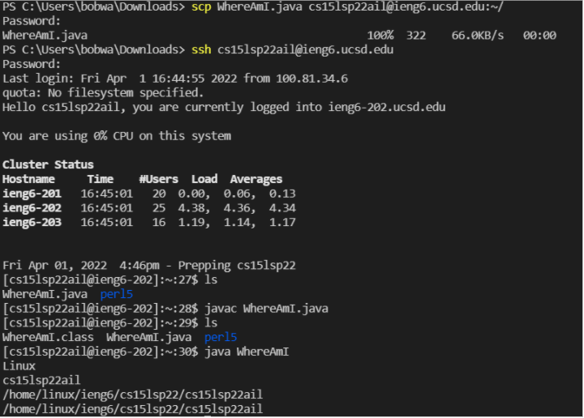
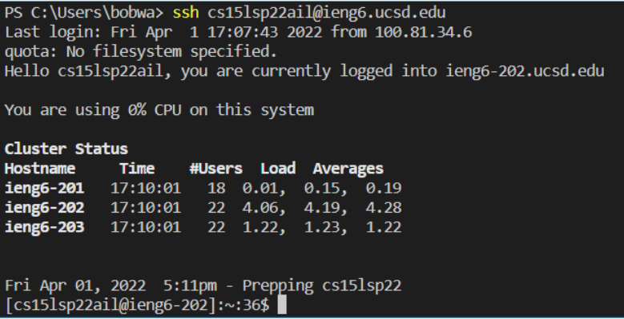
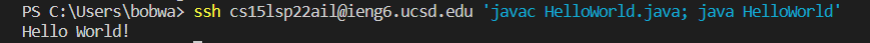

[Back to main page](https://frndlydragon.github.io/cse15l-lab-reports/)

## Part 1: Downloading VScode
Downloading VScode is quite easy. All you need to do is to look up VScode and download it from the Microsoft website. Once you've downloaded the .exe file, you run the file to install the program. When you open the program, you should see something like the image below.

## Part 2: Using SSH Command
Accessing a remote device using the ssh (Secure Shell) command.

It's quite a simple procress. All it requires is typing in a simple line inside the terminal.

`ssh [Username]@server`

The server in this case is ieng6.ucsd.edu. You then will be prompted to type a password in order to access the server. Once you type in your password, your terminal will print out something much like that in the image above. Note that when you are prompted for a password, nothing will show on the terminal as you type. This is for security, so do not be scared and think your keyboard is broken.

## Part 3: Controling a Remote Computer

You can input commands now that will do various things to the remote computer. For instance, you can use the cp command to copy a file from the remote computer.

In the image above, you can see that command being used to try and copy a file named `hello.txt` however it errors as there is no file called `hello.txt`.

## Part 4: Moving Files with `scp`
Now we can learn how to copy local files to a remote folder. To do this, you need to make sure you are in the directory with the file you want to copy. You can do this using a `cd` command. 

Once you are in that directory, you can use the commandline `scp [FileName] username@servername:~/` where filename is the name of the file you want to copy to the server (servername). 

As seen above, I used the `ssh` and `ls` (list) commands to show that the file indeed copied over.

## Part 5: Setting an SSH Key
To set up a key which will allow the remote computer to remember the computer you are logging on from, you need to use the `ssh-keygen` command. 

After using the `ssh-keygen` (`ssh-keygen -t ed25519` for windows) command in your terminal, you do not input a passphrase and indicate what file you want your key to save. 

Two keys will be made, a public and a private. You then need to copy the public key to the remote server using the `scp` command (make sure to create a new directory for the key using `mkdir`).

As seen below, now when you use the `ssh` command, you do not need to input a password.

## Part 6: Optimizing Remote Running
You can input multiple commands simultaneously which can improve workflow. 

For instance, if we have a file in the remote server and we want to compile and execute that file, we can add `java` and `javac` commands to the initial `ssh` command as seen below.

Using the command `ssh username@server 'javac file.java java file'` will run javac and java on the remote server and, if you have a key, the ssh command will immediately connect you to the remote server.