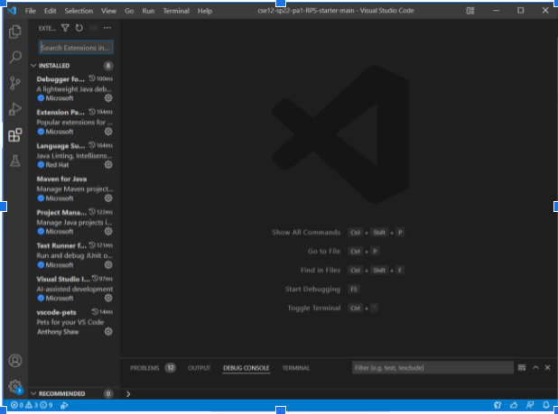

[Back to main page](https://frndlydragon.github.io/cse15l-lab-reports/)

## Part 1: Downloading VScode
Downloading VScode is quite easy. All you need to do is to look up VScode and download it from the Microsoft website. Once you've downloaded the .exe file, you run the file to install the program. When you open the program, you should see something like the image below.

## Part 2: Using SSH Command
Accessing a remote device using the ssh (Secure Shell) command.

It's quite a simple procress. All it requires is typing in a simple line inside the terminal.

`ssh [Username]@server`

The server in this case is ieng6.ucsd.edu. You then will be prompted to type a password in order to access the server. Once you type in your password, your terminal will print out something much like that in the image above. Note that when you are prompted for a password, nothing will show on the terminal as you type. This is for security, so do not be scared and think your keyboard is broken.

## Part 3: Controling a Remote Computer

You can input commands now that will do various things to the remote computer. For instance, you can use the cp command to copy a file from the remote computer.

In the image above, you can see that command being used to try and copy a file named `hello.txt` however it errors as there is no file called `hello.txt`.