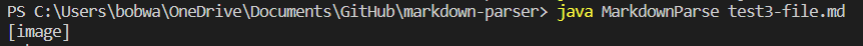
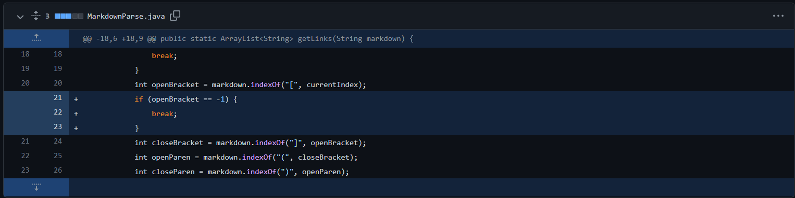
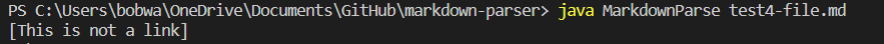
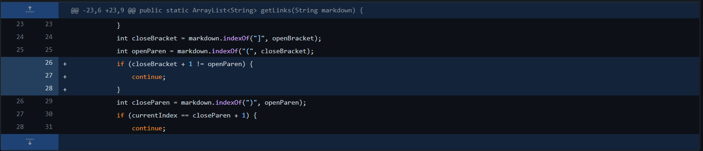
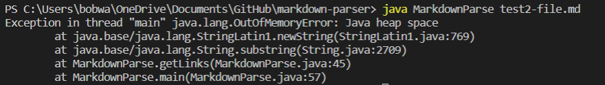
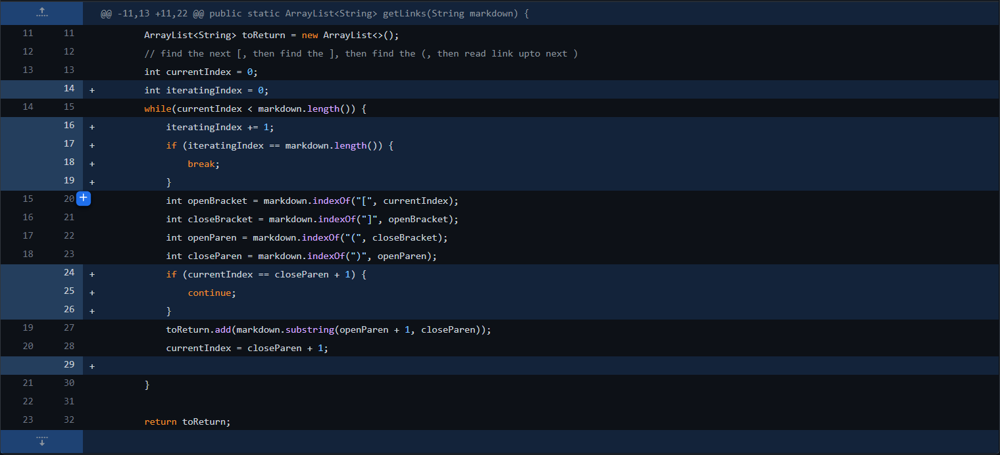

[Back to main page](https://frndlydragon.github.io/cse15l-lab-reports/)

## Test Case 1

The first [test case](https://github.com/FrndlyDragon/markdown-parser/blob/main/test3-file.md) cause this error. 

Symptom: Wrong output. It should be an empty array, but it is not.

Test Case: Using parenthesis with no brackets preceding.

The issue with the program for this test case was that it was not looking for proper syntax and was only looking for open parenthesis. It ignored the fact that brackets need to precede parenthesis.

To fix this, I did this [commit](https://github.com/FrndlyDragon/markdown-parser/commit/e6e96c01077728a2b025d3bf8a876fd9ebc497aa) which adjusted the program to detect this syntax.

## Test Case 2

Another [test case](https://github.com/FrndlyDragon/markdown-parser/blob/main/test4-file.md) that caused errors was one that checked when there was in fact a bracket and parenthesis, but they are not next to each other.

Symptom: Returned [This is not a link] when that should not be returned

Test Case: [] followed by text before (). 

Bug: It printed out an output that was incorrect due to a logical error. This logical error was due to the program's inability to distinguish between normal use of brackets and markdown syntax as it only checks if brackets and parenthesis exist, not if the syntax is correct.

The fix to this was to make sure that the index of the open parenthesis was next to the closed bracket like [this](https://github.com/FrndlyDragon/markdown-parser/commit/fbafc34c743ed84eb0bf0f9eeddbf6b24622c659)

## Test Case 3
The error for this one can be seen below.

A third error was caused by this [test case](https://github.com/FrndlyDragon/markdown-parser/blob/main/test2-file.md). 

Symptom: OutOfMemoryError was thrown

Test Case: Markdown file that did not end with a link.

Bug: An OutOfMemoryError is caused by some process that is running without end until it takes up too much space and crashes the program. This error was caused by a lack of a way to break out of the while loop. When there is something after the last link, like in the test case, the program continually searches for another link but is unable to find one. This causes the error to be thrown.

The fix for this was a simple addition of a way to detect when the file ended as seen [here](https://github.com/FrndlyDragon/markdown-parser/commit/579e858bf81d34f19cc7a80e59d4ab339c28d6e3).

[Back to main page](https://frndlydragon.github.io/cse15l-lab-reports/)