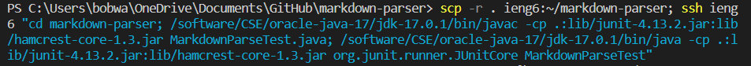

[Back to main page](https://frndlydragon.github.io/cse15l-lab-reports/)

## Part 1: Streamlining ssh Configuration

This is the ```.ssh/config``` file that can be found within your .ssh folder. That is usually located in your user folder. It is currently opened in VSCode so that it can be edited.

The text included is to remove the requirement of typing a username while utilizing the ```ssh``` command. 


Above is the usage of the ```ssh``` command using this config file. As can be observed, only the ieng6 part is now needed to log into the remote computer.


We can also use this shortened version when using the ```scp``` command. As seen above, when we use this command, we only need to type ```ieng6``` rather than the entirety of our username and server. 

## Part 2: Github Access from ieng6


To generate a key as seen above, and link it to your Github account, you need to access your remote account and use the ```ssh-keygen``` command to create a key for your remote account. 


The key will be stored in the .ssh directory within the remote server. Above, the key that we are interested in is the ```id_rsa.pub``` file. We copy this key to paste to Github.


Now, if we edit a file remotely using Vim, we can add it to the staging area and commit it. When we push the commit, it will ask for our username and a password. Note, it no longer requires your actual password. It needs a personal identification token which you can create on Github. 

When you put this token in, you can push these changes and view the commit on your Github repository as can be seen [here](https://github.com/FrndlyDragon/markdown-parser/commit/876739f33233a81aabcceb0974a969842c09c30f).

## Part 3: Copy Whole Directories


Using the ```scp -r``` command allows you to copy entire directories. The ```-r``` portion makes the copying recursive so that every file in the directory will be copied. As you can see, the items are copied over with how long it took and the size of every file.


We can then run commands with this copied directory. As you can see, we access the remote computer and there is a new directory. We can then run the MarkdownParseTest java file and, as in the image shown, it runs without a problem.



We can combine all of these commands into one where we copy the directory, then access the remote server to run the commands. The commands ran on our local machine are separated by semicolon. The commands ran on the remote machine are in the quotes and are in blue.


When we run this command, you can see that the copying is done and when it is finished, it runs the MarkdownParseTest java file immediately.

[Back to main page](https://frndlydragon.github.io/cse15l-lab-reports/)