[Back to main page](https://frndlydragon.github.io/cse15l-lab-reports/)

## Test Case 1
**My MarkdownParser**

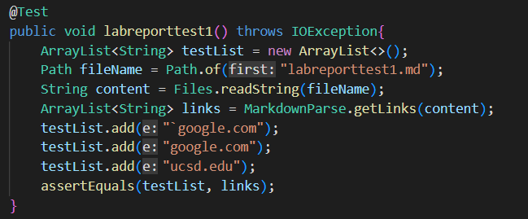

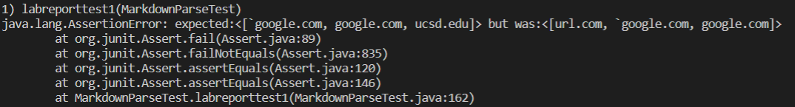

The first test case failed for my implementation. It failed to print one of the links and printed a link that was not considered a link.

To fix this, I believe I would first need to check if there are ' or " present in the text and account for them while scanning for links. Additionally, I would need to only take into account the last closed bracket. 

The quotes are easy to check by looking for the quotes first before brackets. If they close after the brackets, then we ignore those brackets. For the bracket part, we create a loop that checks the next closed bracket before a open parenthesis.

**Other MarkdownParser**
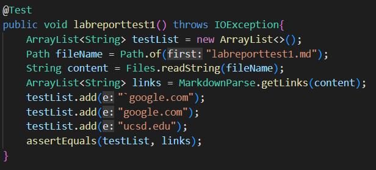
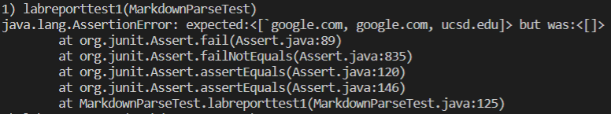
The other markdown parser also failed this test. Their program seems to not have even caught any of the links.
## Test Case 2
**My MarkdownParser**

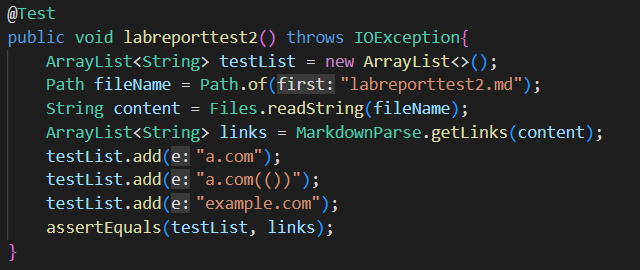
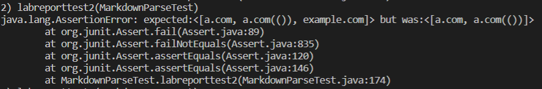

The second test case failed for my implementation. It fails to account for one of the links. 

The reason for this error is the embedded brackets. The program ignored the second open bracket and concluded that the first closed bracket was for the first open bracket. Since there was no parethesis, the program ignored the link.

To fix this, you would just need a way to keep track of every open and closed bracket. A loop that records the number of open and closed brackets would do this quite easily.

**Other MarkdownParser**
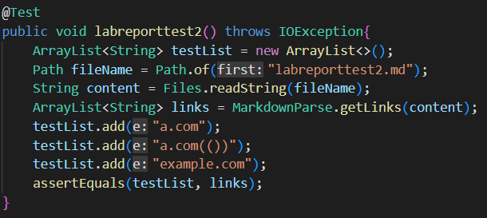
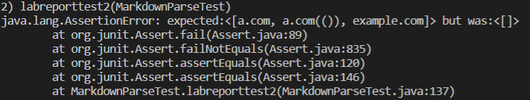

The other parser also failed this test, again failing to catch any of the links.

## Test Case 3
**My MarkdownParser**
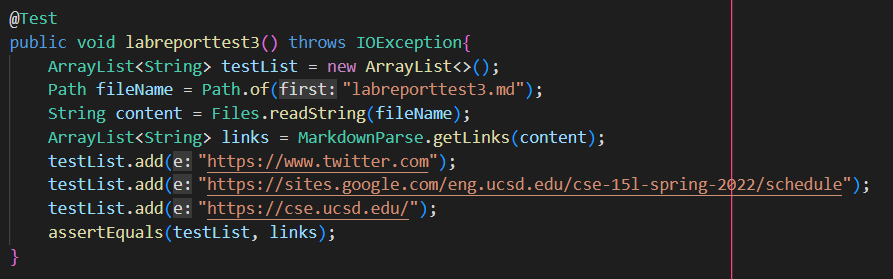
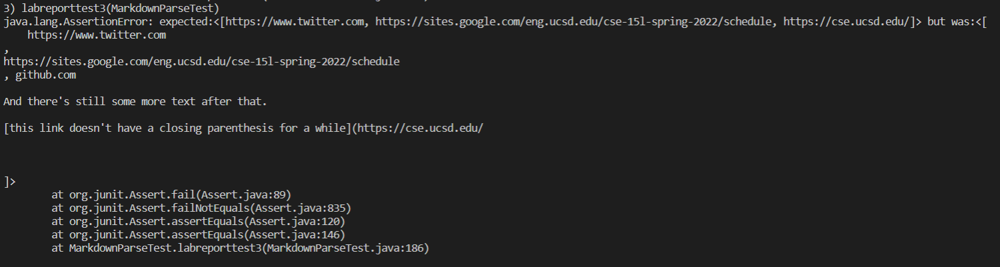

The third test case failed for my implementation. The error here is quite simple to spot. The program doesn't trim out spaces or line breaks and again doesn't account for multiple sets of brackets. 

To fix this, the fix for the second test case would be needed to keep track of brackets and where these brackets are. The next thing would be to make sure that only characters are printed out rather than spaces and line breaks. That can be done with a trim function.

**Other MarkdownParser**
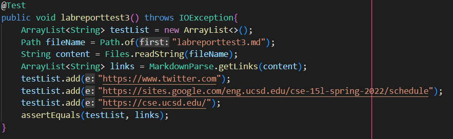
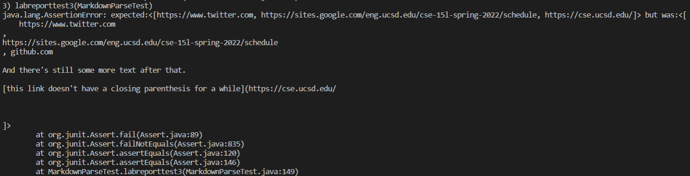
This also failed and the other put looks similar to the output that my version of the markdown parser returned.

[Back to main page](https://frndlydragon.github.io/cse15l-lab-reports/)