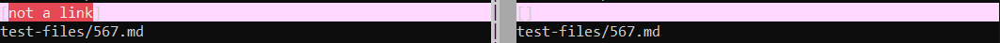
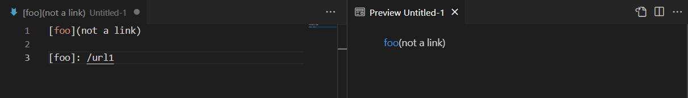
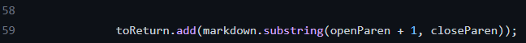
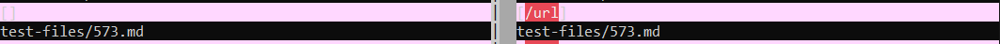
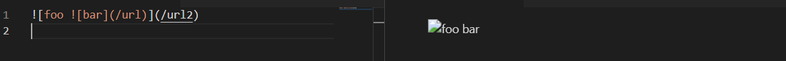
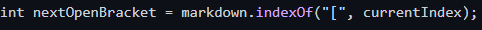

[Back to main page](https://frndlydragon.github.io/cse15l-lab-reports/)

## Test 1
[Test File Discussed](https://github.com/nidhidhamnani/markdown-parser/blob/main/test-files/567.md)

Using vimdiff, I compared the results.txt files from running these tests on two different markdown-parsers. This text file is one of the ones that came out to be different. 

The correct implementation is on the provided repository. The results, while the syntax is correct, should not have anything as there was no actual link.

The expected output should be no links at all as seen here in the preview.

This is caused by the lack of a way to detect whether the text within the correct syntax is actually a valid link. For example, there is nothing within my parser that will check if there is a `https://` or some sort of website suffix like `.com` or `.org`. There are a number of ways to implement this from either checking while adding the link to the output or once the array is completed, going through the contents of the array to make sure that everything within the array is valid. 

Somewhere here, either before or after this line would work. If it is after, we would just take out that element from the list (which is easy as it would be the last element of that list) and check if it contains some sort of suffix. If it is before, we just store that substring into a String variable and do the same check.

## Test 2
[Test File Discussed](https://github.com/nidhidhamnani/markdown-parser/blob/main/test-files/573.md)

Again, using vimdiff, I found this file to have different outputs. However, this time, the correct output was from my repository. Again, there should have been no output as there was no actual link to a website.

As you can see below, there are no actual links.

This is due to the lack of a way for the program to detect whether or not the syntax is for an image or a link. The provided parser only looks for brackets and parenthesis. A way to fix this would be to add a check that will look before the open bracket and see if there is an exclamation mark immediately before it. If there is, then skip that bracket as it is an image link and not a website.

A good place to put this would be right after this line where the index of the open bracket is found. If possible, subtract one from that index and then check if the symbol at that index is an exclamation mark.

